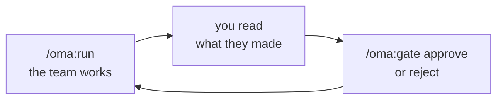

<div align="center">

# Getting started with OMA

**From "I have an idea" to a working, tested application — step by step.**

</div>

---

This guide assumes **nothing**. Not that you've used a terminal, not that you
know what a PRD is, not that you've written code. It walks the entire path in
order, tells you what to type, and tells you what to look at when it stops.

If you already write software, the [README](README.md#-installation) has the
short version.

## 📑 Contents

- [Is this for you?](#is-this-for-you)
- [Part 0 — What you need first](#part-0--what-you-need-first)
- [Part 1 — Install Claude Code](#part-1--install-claude-code)
- [Part 2 — Install OMA](#part-2--install-oma)
- [Part 3 — Start your project](#part-3--start-your-project)
- [Part 4 — The loop you'll repeat 8 times](#part-4--the-loop-youll-repeat-8-times)
- [Part 5 — Walking the eight phases](#part-5--walking-the-eight-phases)
- [Part 6 — The overnight route](#part-6--the-overnight-route)
- [Part 7 — Running your app on your own computer](#part-7--running-your-app-on-your-own-computer)
- [Part 8 — Putting it on the internet](#part-8--putting-it-on-the-internet)
- [Part 9 — When something goes wrong](#part-9--when-something-goes-wrong)
- [Cheat sheet](#cheat-sheet)
- [Glossary](#glossary)

---

## Is this for you?

**OMA is for a person with a clear idea and no team.** A founder, a designer, a
freelancer, someone with a problem worth solving and no budget for five hires.
You bring the judgment about *what to build*. OMA brings the specialists who
build it.

Being honest about what that actually requires:

**What you genuinely don't need**
- Any programming ability. You will never be asked to write code.
- Design skills. You approve designs; you don't make them.
- Knowledge of how software gets built. This guide explains each step as it comes.

**What you do need**
- **A paid Claude account** — Pro, Max, Team or Enterprise. The free plan can't run Claude Code.
- **A computer running macOS or Linux** (or Windows with WSL — see [Part 0](#part-0--what-you-need-first)).
- **A willingness to open the terminal.** That black window that scares people. You'll type about fifteen commands total, all of them copy-paste, and this guide gives you every one.
- **About a working day**, spread across as many sittings as you like. You can stop anywhere and come back next week; nothing is lost.
- **A real budget.** OMA is thorough, not cheap — a full run is dozens of AI dispatches. See [what it costs](#what-does-this-cost).
- **A few hours of your actual attention.** Not while it works — at the eight moments it stops and asks you to approve something. That review is where a good result comes from. If you genuinely can't be there, [the overnight route](#part-6--the-overnight-route) makes those decisions by policy and reports back — but it's a trade, and it's spelled out there.

**What OMA will not do**
- It won't decide what your product should be. It asks; you answer.
- It won't put your app on the internet for you — that's [Part 8](#part-8--putting-it-on-the-internet), and it's deliberately your hands on the controls.
- It won't post to your social accounts. It writes the posts; you publish them.
- It hasn't been proven outside **web apps built with Next.js**. If you want a phone app, this isn't the tool yet.

---

## Part 0 — What you need first

### A Claude account

Go to [claude.com](https://claude.com) and subscribe to **Pro** or higher. The
free tier cannot run Claude Code, which is the program OMA plugs into.

### A terminal

The terminal is a window where you type commands instead of clicking buttons.
Everything below happens there.

| Your computer | How to open it |
|---|---|
| **Mac** | Press `Cmd + Space`, type `Terminal`, press Enter |
| **Ubuntu / Linux** | Press `Ctrl + Alt + T` |
| **Windows** | You need **WSL** first — see below |

When you see a box like this, copy the line into the terminal and press Enter:

```bash
echo "this is what a command looks like"
```

Nothing here can break your computer. If a command fails, it prints a message
and stops — that's all.

<details>
<summary><b>Windows: setting up WSL first</b></summary>

OMA's internals are shell scripts, so it needs a Linux-style environment.
Windows provides one built in. In **PowerShell as Administrator**, run:

```powershell
wsl --install
```

Restart when it asks. From then on, search for **Ubuntu** in the Start menu —
that's your terminal, and every command in this guide goes there, not into
PowerShell.

</details>

### Node.js

Your app will be built with Node.js, so it has to exist before the Build phase.
Check whether you already have it:

```bash
node --version
```

If that prints something like `v22.11.0`, you're set. If it says
`command not found`, install it:

| Your computer | Command |
|---|---|
| **Mac** | `brew install node` — or download from [nodejs.org](https://nodejs.org) |
| **Ubuntu / WSL** | `sudo apt update && sudo apt install nodejs npm` |

<details>
<summary><b>Mac: getting Homebrew, if <code>brew</code> isn't found</b></summary>

Homebrew is the standard way to install developer tools on a Mac:

```bash
/bin/bash -c "$(curl -fsSL https://raw.githubusercontent.com/Homebrew/install/HEAD/install.sh)"
```

Follow its instructions at the end — it usually asks you to run one more command
to finish setup. Then `brew install node`.

</details>

### Git

Git records your project's history so nothing is ever lost. Check for it:

```bash
git --version
```

Missing? `brew install git` on Mac, `sudo apt install git` on Ubuntu/WSL.

### ✅ Checkpoint

Run all four. Every one should print a version number:

```bash
node --version && npm --version && git --version && python3 --version
```

If any says `command not found`, install that one before continuing. Nothing
below works without all four.

---

## Part 1 — Install Claude Code

Claude Code is Anthropic's tool for letting Claude work with files on your
computer. OMA is a plugin for it — so this comes first.

```bash
curl -fsSL https://claude.ai/install.sh | bash
```

That covers Mac, Linux and WSL. Then confirm it worked:

```bash
claude --version
```

You should see something like `2.1.220 (Claude Code)`.

<details>
<summary><b>Other ways to install it</b></summary>

| Platform | Command |
|---|---|
| macOS — Homebrew | `brew install --cask claude-code` |
| Windows — PowerShell (native, no WSL) | `irm https://claude.ai/install.ps1 \| iex` |
| Windows — WinGet | `winget install Anthropic.ClaudeCode` |
| Any — npm (needs Node 22+) | `npm install -g @anthropic-ai/claude-code` |

If something looks wrong, `claude doctor` checks your installation and tells you
what's broken. Full details: [Claude Code setup](https://code.claude.com/docs/en/setup).

</details>

### Sign in

Start it once:

```bash
claude
```

Your browser opens; log in with your Claude account. Back in the terminal you'll
land at a prompt waiting for input. Type `/exit` and press Enter to leave for
now.

---

## Part 2 — Install OMA

**OMA installs directly from GitHub.** It is not in Anthropic's plugin store,
and it doesn't need to be — in Claude Code, a "marketplace" is just a code
repository, and OMA's repository is one.

Two commands:

```bash
claude plugin marketplace add webmehedi/oma
claude plugin install oma@oma
```

The first tells Claude Code where OMA lives. The second installs it.

### Check it worked

```bash
claude plugin list
```

You should see `oma@oma` marked **enabled**. For more detail:

```bash
claude plugin details oma
```

A complete install reports **8 skills, 12 agents and 4 hooks**. If you see fewer,
or nothing at all, jump to
[TROUBLESHOOTING](TROUBLESHOOTING.md#installation) — it's indexed by the exact
error message.

<details>
<summary><b>Using the Claude desktop app instead of the terminal?</b></summary>

Run the same two commands above in a terminal once — the desktop app's built-in
terminal works fine. Then **restart the app**. OMA appears under the **+** button
beside the prompt box → **Plugins**, and its commands work in any Code-tab
session.

The reason you can't do it entirely in the app: its plugin browser only lists
marketplaces you've already added, and adding one is a terminal step.

</details>

---

## Part 3 — Start your project

### Make a folder for it

Every project lives in its own folder. Make one and go into it:

```bash
mkdir ~/my-project
cd ~/my-project
```

Replace `my-project` with a real name — `invoice-app`, `gym-booking`, whatever
you're building. Use dashes, not spaces.

> `~` means your home folder, so this creates it right next to Documents and
> Downloads.

### Open Claude Code there

```bash
claude
```

You're now in a session, in your project folder. Everything from here is typed
at that prompt, not the terminal.

### Describe your idea

```
/oma:init "Invoicing app for freelancers who hate invoicing"
```

**One sentence. Who it's for, and what it does.** That's genuinely enough — the
next step is a conversation where the details get pulled out of you.

Some examples that work well:

- `/oma:init "Booking system for a small yoga studio with class packs"`
- `/oma:init "Internal tool for tracking which of our 200 clients renewed"`
- `/oma:init "Recipe site where users save recipes to collections"`

What makes a bad one: `"a social network"` (too vague to scope),
`"an app"` (no idea what it does), or three paragraphs of features (you'll be
asked about each anyway — start with the core).

### Answer the intake questions

OMA asks **5–8 questions**. They're the questions a good contractor asks before
quoting: who uses this, what's the one thing it must do, is there a login, does
money change hands, anything explicitly *not* in scope.

Two rules for answering:

1. **"I don't know" is a real answer.** It gets recorded as an open question and
   revisited later, which is far better than a guess you'll build on.
2. **Be specific about what you're *not* building.** "No mobile app", "no
   payments in v1", "English only". Scope you rule out here is scope you don't
   pay for later.

When it's done you'll have a `.oma/` folder — that's OMA's memory of your
project. Take a look if you're curious:

```bash
ls .oma
```

---

## Part 4 — The loop you'll repeat 8 times

Building your project is one three-step loop, eight times. Learn it once:



### Step 1 — run the phase

```
/oma:run
```

The specialists for this phase go to work. This takes **minutes, not seconds** —
some phases run several agents. You'll see progress as it happens. Let it finish.

### Step 2 — read what they produced

It stops and tells you exactly which files to look at. **Read them.** This is the
part that decides whether you get something good.

You don't need a code editor. Ask right there in the session:

```
show me the PRD
```

or

```
explain the data model to me like I'm not technical
```

It's the same Claude — it will read the file and walk you through it.

### Step 3 — decide

Happy?

```
/oma:gate approve
```

Not happy? Say why, in plain words:

```
/oma:gate reject "the scope is way too big — cut recurring invoices for now"
```

The phase runs again with your correction as input. **Rejecting is normal and
cheap.** Rejecting Discovery costs you one phase. Discovering the same problem
after the app is built costs you the whole build.

### Between phases

```
/clear
```

This wipes the conversation but not the project — every decision lives in files
on disk. It keeps things fast and cheap. Optional, but recommended.

### Lost your place?

```
/oma:status
```

Tells you where the project stands and the exact next command. This works after
five minutes away or five weeks. If you remember one command from this guide,
make it this one.

---

## Part 5 — Walking the eight phases

Same loop each time. What changes is what you're reviewing — and the review
matters more in some phases than others.

> **Effort ratings below** are how much of *your* attention the review deserves,
> not how long the phase takes to run.

---

### Phase 1 · Discovery 📋 — *what are we building?*

**Who works:** the Project Manager.
**You get:** a **PRD** — the document listing everything your product must do,
each item numbered `REQ-001`, `REQ-002` and so on. Plus who it's for, how you'll
know it worked, and an explicit list of what's out of scope.

**Your review — ⭐⭐⭐ the most important one in the whole project.**

Everything after this is built from this document. A misunderstanding here
survives all the way to the finished app.

Read the PRD line by line and check:

- Is anything **missing** that you assumed was obvious? Write it down now.
- Is anything there you **didn't ask for**? Cut it. Every requirement becomes
  code, tests and cost.
- Does the out-of-scope list match what you actually meant?

Ask for what you need:

```
walk me through the PRD requirement by requirement
```

Then approve — or reject with specifics: `/oma:gate reject "REQ-004 client
portal isn't v1, and I need multi-currency which is missing"`.

---

### Phase 2 · Architecture 🏗️ — *how will it be built?*

**Who works:** the Architect.
**You get:** the technology choices with exact versions, the **data model** (what
information your app stores), the **API contract** (how the parts talk to each
other), and **ADRs** — short notes recording *why* each significant decision was
made.

**Your review — ⭐⭐ mostly one thing.**

The technology choices you can reasonably trust; they're the default stack and
the Architect proves the versions work together before finishing.

What you *should* check is the **data model**, because it's about your business,
not about code. Ask:

```
explain the data model in plain english — what does the app remember about each customer?
```

Then verify against reality: can one client have several projects? Does an
invoice need a due date separate from its issue date? Do you need to keep
deleted records? Getting this wrong is expensive to fix later — it's the one
thing here worth real scrutiny.

At the end of this phase the stack and data model are **frozen** — locked, so
nothing can silently drift from them later. Changing them afterwards is still
possible, just deliberate ([`/oma:change`](#cheat-sheet)).

---

### Phase 3 · Design 🎨 — *what will it look like?*

**Who works:** the UX Designer.
**You get:** a design system, colors and typography, and — the good part —
**clickable mockups**. Real web pages, not pictures of web pages.

**Your review — ⭐⭐⭐ and the most enjoyable.**

Open the mockups. In a *second* terminal window (leave Claude Code running):

```bash
cd ~/my-project
python3 -m http.server 4173 -d .oma/03-design/mockups
```

Then open **http://localhost:4173** in your browser.

Click everything. Every screen has five versions — empty, loading, full of data,
error, and the awkward edge case — because those are where real apps fall apart.

This is your one cheap chance to change the interface. Once Build starts, the
frontend developer treats these mockups as the target, so changes get more
expensive from here:

```
/oma:gate reject "the dashboard is too busy — I want the outstanding total front and center"
```

Press `Ctrl + C` in that second terminal when you're finished looking.

---

### Phase 4 · Build 🔨 — *making it real*

**Who works:** Frontend and Backend developers, at the same time.
**You get:** the actual working application.

**Your review — ⭐ mostly patience.**

This is the longest phase by a wide margin. Two agents work in parallel — the
backend builds the database and the logic, the frontend builds the screens —
each against the frozen contract, which is what stops them from drifting apart.

**You will probably see an agent fail mid-run.** It looks alarming and isn't:
the work is saved to disk continuously, and running `/oma:run` again picks up
exactly where it stopped, scoped to what's missing. In the validation project
this happened three times in one build phase. Normal at this scale.

There's little for you to judge here. The real review is next.

---

### Phase 5 · QA ✅ — *does it actually work?*

**Who works:** the QA Engineer — a *different* agent from the ones who built it,
deliberately.
**You get:** a test suite that really runs, and a report on what passed and what
didn't.

**Your review — ⭐⭐ read the report.**

QA runs real commands and records the real exit codes. Critically, **QA files
problems and never fixes them** — because an agent allowed to fix its own
findings has an incentive to find fewer. Anything broken becomes a task, and
Build runs again to repair it. Up to three rounds.

In the validation run, QA caught nine tasks the build agents had marked "done"
against tests that didn't exist. That's the entire reason this phase is
separated.

If it's still red after three rounds, you get a choice: fix it yourself, or
approve with your reasons recorded — and every accepted failure gets named in
the final report, so nothing is buried.

---

### Phase 6 · DevOps 🔒 — *is it safe, and can it run anywhere?*

**Who works:** the Security Engineer, then the DevOps Engineer.
**You get:** a security review based on real probes against your running app,
plus the configuration files needed to run it on a server.

**Your review — ⭐⭐ read the security findings.**

Security doesn't just read the code — it *attacks* the running app: can user B
reach user A's data, are there secrets committed by accident, can inputs break
things. Findings are graded, and anything critical or high goes back to Build to
be fixed, up to two rounds.

Read the findings, including any that stay open. If you approve with something
unfixed, that decision is recorded by name in the ship report.

---

### Phase 7 · Growth 📣 — *how will anyone find it?*

**Who works:** SEO, Marketing and Social, all three at once.
**You get:** search metadata written **into your actual code**, positioning,
landing page copy, a launch plan, and 30 days of social posts drafted in each
platform's real format.

**Your review — ⭐⭐ fact-check the claims.**

These agents are forbidden from inventing testimonials, user counts, revenue,
ratings or awards — every claim has to trace back to something your app really
does. Read the marketing copy anyway and confirm it describes *your* product.
You're the one whose name goes on it.

Nothing here gets published. The posts are drafts in files; you decide if and
when.

---

### Phase 8 · Ship 🚀 — *is it really finished?*

**Who works:** no agents — this is a verification pass.

```
/oma:ship
```

**You get:** a fresh copy of your project cloned from scratch, installed and
tested from zero — because "it works on my machine" is the oldest lie in
software. Plus a README for your project and a **ship report** listing what
shipped, what didn't, and every known issue by name.

**Your review — ⭐⭐ read the ship report, especially the known issues.**

That's your honest inventory of what you now own.

🎉 **You have a finished application.**

---

## Part 6 — The overnight route

Everything above assumes you're at the keyboard for eight reviews. Sometimes
you're not — you have the idea at 11pm and you'd rather wake up to a project.

```
/oma:auto "Invoicing app for freelancers who hate invoicing"
```

That runs **all eight phases without stopping**, and leaves you a report.

### It asks more questions first, on purpose

In the normal loop, questions come up mid-project and you're there to answer
them. Nobody will be. So `/oma:auto` front-loads them: the usual intake, plus
what it will otherwise have to guess —

- what it should look like (one reference site, or three adjectives)
- whether people log in, and whether they share anything
- whether it takes payments in version 1
- where you eventually want it hosted
- whether to fill it with demo data, so there's something to see in the morning
- one sentence describing what would make this a success

Then it asks for your **standing decisions** — the answers you'd have given at
the gates. Take the defaults unless you have a reason; they're chosen to keep
mistakes small:

| It asks | Default | Meaning |
|---|---|---|
| Scope when unsure | **cut** | Leave it out and note it, rather than build something you didn't ask for |
| A question comes up | **assume** | Pick the option that's cheapest to undo, write it down, keep going |
| A locked decision needs changing | **stop** | This is a re-plan. Wake up to a question, not a surprise |
| Tests still failing | **stop** | Better a halted run than a green-looking broken app |
| A critical security problem | **stop** | — |

### Before you walk away

Your computer must stay awake. In a **second terminal window**:

```bash
caffeinate -i -t 36000
```

That's a Mac (10 hours). On Ubuntu or WSL:
`systemd-inhibit --what=idle --why="OMA run" sleep 10h`. Leave the window open.

### In the morning

```
/oma:status
```

It tells you whether the run finished or stopped, and where. The full report is
at `.oma/auto/run-1.md` — open it in any text editor, or just ask in the
session: `summarize the overnight report for me`.

It's written to be read in that order:

1. **What happened** — finished, or stopped at phase N because of X.
2. **Look at these three things first.** The most useful part. These are the
   things nobody could check for you: are these the right requirements, does the
   design look right, is that security finding acceptable to you.
3. **What it assumed on your behalf** — every one, with the command that undoes it.
4. **Known issues**, by name. Nothing swept under the rug.
5. **What to run next.**

**If it stopped**, nothing is lost — every finished phase is saved and recorded,
exactly as if you'd approved it. Answer what it asked, then:

```
/oma:auto resume
```

### The honest trade

The gates exist to catch a misunderstanding early. Turning them off means a
misread requirement in phase 1 survives to phase 8 — and that is the single most
expensive way for one of these projects to go wrong.

The run does check what can be checked: that the versions it picked actually work
together, that every finished task points at a real file and a real test, that
the mockups load, that a fresh copy of the project installs and passes its tests.
What it can't check is *taste and intent* — whether these are the requirements
you meant, whether the design looks right. Those go straight into the report's
"look at this first" list instead of being quietly passed.

> **The best of both:** run Discovery yourself, then go to bed.
>
> ```
> /oma:run              # Discovery — takes a few minutes
>                       # …read the requirements…
> /oma:gate approve
> /oma:auto             # the other seven phases, overnight
> ```
>
> Ten minutes of reading a requirements list is worth more than every automatic
> check in this guide.

---

## Part 7 — Running your app on your own computer

Try it before showing anyone. In your project folder:

```bash
npm install
npm run dev
```

Then open **http://localhost:3000**.

The first command downloads everything your app depends on — slow the first time,
a few minutes is normal. The second starts your app. `Ctrl + C` stops it.

<details>
<summary><b>If it doesn't start</b></summary>

Start Claude Code in the project and just say what happened:

```
npm run dev fails with this error: <paste the red text>
```

It has full context on your project and can fix it. Also check
`.oma/06-devops/env.template` — apps often need settings like a database
location filled in before they'll boot.

</details>

---

## Part 8 — Putting it on the internet

**OMA deliberately does not do this.** Not a missing feature — a decision. Going
live means your accounts, your credentials, your bill and your name on whatever
appears. That stays a human action, and it's enforced: deploy commands are
blocked from running inside an OMA project.

What OMA gives you instead is the exact instructions:

```
.oma/06-devops/deploy-runbook.md
```

It has the real commands for your project. Read it, then run them yourself, in
your own terminal, outside the OMA session. If a step isn't clear, ask:

```
explain step 3 of the deploy runbook — what am I actually doing there?
```

**Before you go live**, from the runbook and ship report:

- [ ] Every value in `env.template` has a real value set on the host
- [ ] `NEXT_PUBLIC_SITE_URL` points at your real domain, not `localhost`
- [ ] The database has a backup plan
- [ ] Known issues in the ship report are ones you can live with

---

## Part 9 — When something goes wrong

The five things that will actually happen, and what they mean.

<table>
<tr><th align="left">You see</th><th align="left">What it means</th><th align="left">Do this</th></tr>
<tr>
<td>An agent stops with an error mid-phase</td>
<td>Routine at this scale. Its work is already saved.</td>
<td><code>/oma:run</code> again — it resumes at the gap</td>
</tr>
<tr>
<td>"blocked" in <code>/oma:status</code></td>
<td>Something needs <em>your</em> decision, or a limit was hit</td>
<td><code>/oma:status</code> names the reason and the fix</td>
</tr>
<tr>
<td>A question you can't answer</td>
<td>It refuses to guess on your behalf</td>
<td>Answer as best you can, or say you don't know — it gets recorded</td>
</tr>
<tr>
<td>You changed your mind after approving</td>
<td>Nothing is permanent</td>
<td><code>/oma:phase 03-design "make it denser"</code> re-runs that phase</td>
</tr>
<tr>
<td>You closed everything and forgot where you were</td>
<td>Nothing was in the conversation anyway</td>
<td><code>cd</code> to the folder, <code>claude</code>, <code>/oma:status</code></td>
</tr>
</table>

Longer list, with the reasoning behind each:
**[TROUBLESHOOTING.md](TROUBLESHOOTING.md)**.

### What does this cost?

OMA is thorough, not cheap. A full eight-phase run is dozens of AI dispatches,
and the validation project took roughly a working day of wall-clock time.

Four levers, strongest first:

1. **Stop early at a gate.** Gates exist so a misread requirement costs one phase
   instead of an entire build. Reading the Discovery gate carefully is the
   highest-value minute in the project.
2. **Cut scope in Discovery.** Every "nice to have" becomes code, tests, QA
   rounds and security review. Cutting it in phase 1 is free; cutting it in
   phase 5 isn't.
3. **`/clear` between phases.** Smaller conversations, cheaper runs.
4. **Don't re-run phases out of curiosity.** A re-run costs about what the
   original did.

---

## Cheat sheet

Every command you'll use, in the order you'll need them.

**Terminal — once, at setup**

| Command | What it does |
|---|---|
| `curl -fsSL https://claude.ai/install.sh \| bash` | Install Claude Code |
| `claude plugin marketplace add webmehedi/oma` | Point Claude Code at OMA |
| `claude plugin install oma@oma` | Install OMA |
| `claude plugin list` | Check it's installed |

**Terminal — for each project**

| Command | What it does |
|---|---|
| `mkdir ~/my-project && cd ~/my-project` | Create the project folder and enter it |
| `claude` | Start a session in that folder |
| `python3 -m http.server 4173 -d .oma/03-design/mockups` | View the mockups at `localhost:4173` |
| `caffeinate -i -t 36000` | Mac: stop the computer sleeping during an overnight run |
| `npm install && npm run dev` | Run your finished app at `localhost:3000` |

**Inside Claude Code**

| Command | What it does |
|---|---|
| `/oma:init "<your idea>"` | Start a project |
| `/oma:run` | Run the next phase |
| `/oma:auto "<your idea>"` | Run **every** phase unattended — [the overnight route](#part-6--the-overnight-route) |
| `/oma:auto resume` | Continue an overnight run that stopped |
| `/oma:status` | **Where am I, what's next** — the one to remember |
| `/oma:gate approve` | Accept this phase |
| `/oma:gate reject "<why>"` | Send it back with a correction |
| `/oma:phase <name> "<what to change>"` | Deliberately redo a finished phase |
| `/oma:change "<request>"` | Change something frozen (shows impact first) |
| `/oma:task list` | See the backlog |
| `/oma:ship` | Final verification and report |
| `/clear` | Clear the conversation, keep the project |

---

## Glossary

Every term in this guide that isn't ordinary English.

| Term | In plain words |
|---|---|
| **Agent** | One AI specialist with one job — a designer, a tester. Twelve of them, each ignorant of the others' work except through written handoffs. |
| **Phase** | One stage of building. Eight of them, always in order. |
| **Gate** | The stop at the end of a phase where you approve or reject. Nothing proceeds without you. |
| **PRD** | Product Requirements Document. The numbered list of what your product must do. |
| **REQ-001** | The ID of one requirement. Every piece of work has to point at one, which is how scope creep gets caught. |
| **Data model** | What your app remembers, and how those things relate — customers, invoices, which belongs to whom. |
| **API contract** | The agreed list of what the front and back of your app can ask each other for. Frozen so both sides can be built at once. |
| **Frozen** | Locked against edits. A guard actively blocks changes; `/oma:change` is the deliberate way through. |
| **ADR** | Architecture Decision Record. A short note saying why a choice was made, so nobody has to guess later. |
| **Handoff** | The written record one agent leaves for the next. Agents can't talk, so they write. |
| **Repository / repo** | Your project folder, with its full history. |
| **Commit** | A saved checkpoint in that history. OMA commits after each phase, so you can always go back. |
| **Brownfield** | Pointing OMA at a codebase that already exists, instead of starting fresh. |
| **Greenfield** | Starting from an empty folder — what this guide describes. |
| **Terminal** | The window where you type commands. |
| **localhost** | Your own computer, acting as a web server. `localhost:3000` is a site only you can see. |
| **Hook** | An automatic rule that runs during a session — blocking edits to frozen files, logging every command, preventing accidental deploys. |
| **Stack** | The set of technologies your app is built from. |
| **Mockup** | A clickable fake of your app's screens, built before any real code. |
| **Unattended run** | `/oma:auto` — the whole pipeline with nobody watching, approving each gate against a checklist instead of asking you. |
| **Autonomy policy** | The standing answers you give an unattended run before it starts: cut scope or include it, stop on a problem or carry on. |
| **Halt** | An unattended run stopping on purpose because it hit something it shouldn't decide alone. Everything finished is saved; `/oma:auto resume` continues. |

---

<div align="center">

**Stuck on something this guide didn't cover?**
[Open an issue](../../issues) — questions are as useful as bug reports.

[← Back to the README](README.md)

</div>
