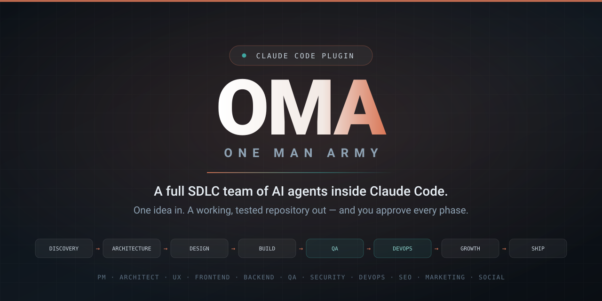
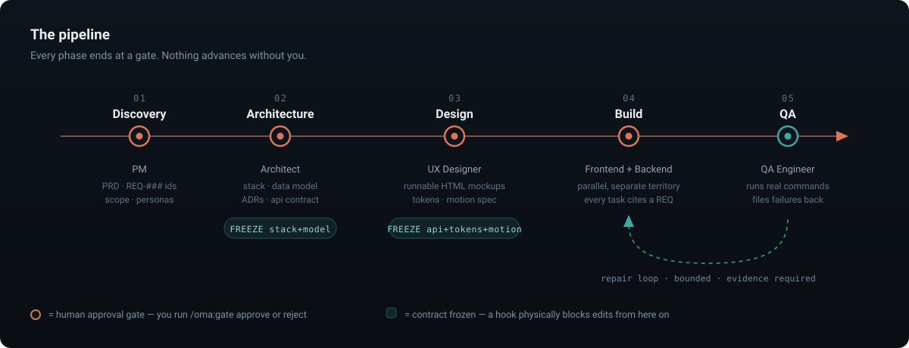
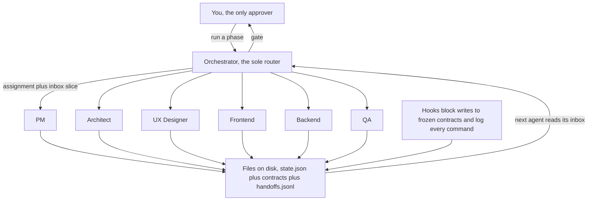

<div align="center">



# OMA — One Man Army

**A full SDLC team of AI agents inside [Claude Code](https://claude.com/claude-code).**
Give it a project idea; it runs Discovery → Architecture → Design → Build → QA →
DevOps → Growth → Ship with role-specialized agents — Project Manager,
Architect, UX Designer, Frontend, Backend, QA, Security, DevOps, SEO, Marketer,
Social — and stops at a gate after every phase for your approval.

[](LICENSE)
[](.claude-plugin/plugin.json)
[](https://docs.claude.com/en/docs/claude-code/plugins)
[](#-the-team)
[](#-contributing)

*You are the one-person company. OMA is your team.*

</div>

---

## 🎯 What is OMA?

OMA is an open-source **Claude Code plugin** that turns a one-line project idea
into a working, tested repository — the way a real software team would build it,
not the way a single chat session flails at it.

It is a **multi-agent SDLC pipeline**: eleven role-specialized AI agents —
project manager, software architect, UI/UX designer, frontend developer,
backend developer, QA engineer, security engineer, DevOps engineer, SEO
specialist, marketer and social media manager — that coordinate through
**durable on-disk state** instead of conversation. Sessions are disposable.
The project isn't.

Three things make it different from "ask an AI to build my app":

1. **Phase gates.** Nothing advances until *you* approve. The expensive failure
   mode in AI-built software isn't bad code — it's confident, complete-looking
   output built on a misread requirement. Gates catch that while it's cheap.
2. **Frozen contracts.** The API contract, data model, design tokens and motion
   spec freeze at the gate that authored them, and a plugin hook **physically
   blocks** edits afterward. This is what lets Frontend and Backend build in
   parallel without drifting apart.
3. **Evidence over claims.** A hook logs every shell command and exit code, so
   "the tests pass" is checkable against reality — and in validation, that's
   exactly what caught nine tasks marked done against tests that never existed.

> **Status: M4.** All eight phases are implemented, Intake through Ship.
> Discovery → QA is **validated end-to-end on a real project**; DevOps, Growth
> and Ship are new in v0.4.0 and not yet proven on a full run — see the
> [Roadmap](#-roadmap).

## 📑 Table of contents

- 🚀 [Quick start](#-quick-start)
- 🚦 [The pipeline](#-the-pipeline)
- 📦 [What you actually get](#-what-you-actually-get)
- 👥 [The team](#-the-team)
- ⚡ [Commands](#-commands)
- 🔧 [How it works](#-how-it-works)
- 🧪 [Proven on a real project](#-proven-on-a-real-project)
- 🧱 [The default stack](#-the-default-stack)
- 📋 [Requirements](#-requirements)
- ❓ [FAQ](#-faq)
- 🧭 [Roadmap](#-roadmap)
- 🚧 [Honest limits](#-honest-limits)
- 🤝 [Contributing](#-contributing)
- 📜 [License](#-license)

## 🚀 Quick start

**Install** — inside Claude Code:

```
/plugin marketplace add webmehedi/oma
/plugin install oma@oma
```

For local development instead: `claude --plugin-dir /path/to/oma`

**Start a project:**

```bash
mkdir my-new-project && cd my-new-project && claude
```

```
/oma:init "Invoicing app for freelancers who hate invoicing"
```

Answer 5–8 intake questions. Then the loop — run a phase, review, approve:

```
/oma:run            # runs the next phase, stops at the gate
                    # …review what the agents produced…
/oma:gate approve   # or: /oma:gate reject "the scope is too big"
/clear              # optional but recommended — all state lives on disk
/oma:run            # next phase
```

At the Design gate you get real, clickable mockups — not screenshots, not
"here's a wireframe description":

```bash
python3 -m http.server 4173 -d .oma/03-design/mockups
```

Lost the thread? `/oma:status` tells you where the project stands and the exact
next action. Close your laptop mid-project, come back next week, continue.

## 🚦 The pipeline



| # | Phase | Agent(s) | Produces | Freezes |
|---|---|---|---|---|
| 01 | **Discovery** | Project Manager | PRD with stable `REQ-###` ids, scope boundary, personas, success metrics | — |
| 02 | **Architecture** | Architect | `stack.md` with proven version pins, data model, API contract, ADRs | stack, data model |
| 03 | **Design** | UX Designer | Design system, `tokens.json`, motion spec, **runnable HTML/CSS mockups** | api, tokens, motion |
| 04 | **Build** | Frontend ∥ Backend | Working application code, in parallel, against frozen contracts | — |
| 05 | **QA** | QA Engineer | Test plan, real command runs, failures filed back as tasks | — |
| 06 | **DevOps** | Security, then DevOps | Security review with real probes, CI, Dockerfile, `env.template`, deploy runbook | — |
| 07 | **Growth** | SEO ∥ Marketer ∥ Social | Metadata/sitemap/JSON-LD **in the code**, positioning, landing copy, launch plan, 30-day calendar | — |
| 08 | **Ship** | *(no agents)* | Ship-time verification run, the project's README, the ship report | — |

Each phase ends at a gate, commits its work, and tags it (`oma/gate-03-design`),
so every phase of your project's history is a checkpoint you can diff or roll back to.

## 📦 What you actually get

Not a chat log. A repository, plus the paper trail a real team would have left:

```
your-project/
├── src/  app/  tests/          # the actual working application
├── CLAUDE.md                   # rewritten at every gate — context for any future session
└── .oma/
    ├── state.json              # source of truth: phases, gates, frozen contracts, open questions
    ├── brief.md                # your idea, normalized
    ├── 01-discovery/           # PRD (REQ-### ids), scope, personas, metrics
    ├── 02-architecture/        # stack.md, data-model.md, api-contract.yaml, adr/
    ├── 03-design/              # design system, tokens.json, motion-spec.md
    │   └── mockups/            #   runnable HTML — open it in a browser
    ├── 04-build/tasks.json     # the backlog — every task cites a REQ
    ├── 05-qa/                  # test plan + evidence-based run reports
    ├── 06-devops/              # security-review.md, deploy-runbook.md, env.template
    ├── 07-growth/              # seo-brief, positioning, landing-copy, launch-plan
    │   └── posts/              #   drafted social posts, one file each
    ├── 08-ship/ship-report.md  # what shipped, what didn't, what's known-broken
    └── log/
        ├── handoffs.jsonl      # the message bus — how agents talk
        └── commands.jsonl      # every command + exit code — the anti-fabrication trail
```

Plus, in the repository proper: `Dockerfile`, `.github/workflows/ci.yml`, the
SEO metadata in your routes, and a `README.md` written at ship time.

**The mockups are the headline.** Before a single line of application code
exists, you get real HTML/CSS you can click through — with production-grade
motion built on [Motion](https://motion.dev) and [Lenis](https://lenis.darkroom.engineering),
five states per screen (empty, loading, populated, error, edge), and real
content instead of lorem ipsum. Approve the interface *before* it's expensive
to change. The Frontend agent then treats mockup fidelity as its definition of done.

## 👥 The team

| Agent | Role | Ships in |
|---|---|---|
| `oma-project-manager` | Requirements, scope discipline, `REQ-###` traceability, backlog | ✅ v0.3 |
| `oma-architect` | Stack selection with *proven* version pins, data model, API contract, ADRs | ✅ v0.3 |
| `oma-ux-designer` | Design system, tokens, motion spec, runnable HTML mockups | ✅ v0.3 |
| `oma-frontend` | UI implementation at mockup fidelity, against the frozen API contract | ✅ v0.3 |
| `oma-backend` | Schema, migrations, endpoints, business logic, tests | ✅ v0.3 |
| `oma-qa` | Runs real commands, judges against acceptance criteria, **files — never fixes** | ✅ v0.3 |
| `oma-security` | Probes the running app for broken authorization, secrets, injection, weak sessions; files findings by severity | ✅ v0.4 |
| `oma-devops` | CI, multi-stage container, env template, deploy runbook — each proven locally before handoff | ✅ v0.4 |
| `oma-seo` | Metadata, canonical URLs, sitemap, robots, JSON-LD **written into the codebase**, plus the keyword brief | ✅ v0.4 |
| `oma-marketer` | Positioning, landing copy, launch plan — every claim traced to a shipped requirement | ✅ v0.4 |
| `oma-social` | 30-day calendar and the actual post drafts, in each platform's real format | ✅ v0.4 |

## ⚡ Commands

| Command | Does |
|---|---|
| `/oma:init "<idea>"` | Intake: brief, clarifying questions, workspace, state |
| `/oma:run` | Advance one phase, stop at the gate |
| `/oma:status` | Where the project stands + the exact next action |
| `/oma:gate approve \| reject "why"` | Your decision on the current phase |
| `/oma:phase <name> "<corrections>"` | Deliberately re-run a phase (e.g. redesign) |
| `/oma:change "<request>"` | Change a frozen contract: impact analysis → your decision → versioned re-freeze → rework tasks |
| `/oma:task list \| add \| close \| reassign` | Manual backlog control |
| `/oma:ship` | Final assembly: ship-time verification run, project README, ship report, deploy checklist |

## 🔧 How it works

**Claude Code subagents cannot talk to each other.** Each runs in an isolated
context and returns one text summary. OMA's entire architecture follows from
taking that constraint seriously instead of pretending otherwise.



- **The filesystem is the message bus.** Agents coordinate the way real teams
  do: through artifacts. Every agent ends by appending a structured handoff
  record to `.oma/log/handoffs.jsonl`; the next agent reads its inbox from there.
- **No agent ever spawns another agent.** The orchestrator routes everything —
  otherwise you get depth limits, lost state, bypassed gates and unbounded cost.
- **`.oma/state.json` is the single source of truth** — phases, gates, frozen
  contract hashes, open questions. The project state never lives in conversation.
- **Every task traces to a requirement.** Work citing no `REQ-###` is scope
  creep, and gets rejected at the gate.
- **Hooks enforce what prompts can't.** A `PreToolUse` hook denies writes to
  frozen contracts (verified by SHA-256); a `PostToolUse` hook logs every shell
  command and its exit code; a `SubagentStop` hook catches agents that finish
  without handing off. Prompts are requests. Hooks are walls.
- **Blocking questions halt the pipeline.** When an agent hits a decision only
  you can make, the system stops and asks rather than building on a guess.

Full architecture and rationale: **[DESIGN.md](DESIGN.md)**.

## 🧪 Proven on a real project

OMA was validated end-to-end by building **Ledgerly**, a freelancer invoicing
app, from a single sentence through to a green test suite. Not a demo — a real
run, with real failures. What came out:

| | |
|---|---|
| Tasks completed | **28 / 28**, every one citing a requirement |
| Test suite | **191 unit tests + 11 Playwright e2e**, all passing |
| Pipeline | typecheck **0** · lint **0** · format **0** · build **0** |
| Contract drift after 23 agent dispatches | **zero** — all 4 frozen contracts hash-matched |
| Territory violations during parallel Frontend ∥ Backend | **zero** |

The interesting part is what went *wrong*, because that's what the architecture
exists for:

- **QA caught nine tasks marked `done` against vitest tests that did not
  exist.** The build agents had accepted their own work. Because QA files and
  never repairs, it produced a real 167-test suite instead of quietly writing a
  token one.
- **QA then mutation-tested that suite** with ten deliberate defects the Backend
  agent had never named — all caught, control clean. The verifier verified the
  verifier.
- **`/oma:change` ran for real** when QA found the money columns couldn't hold
  values the API contract accepts: impact analysis → unfreeze → surgical schema
  edit + a new ADR → re-freeze at v1.1 with a new hash → migration implemented.
- **Agents died three times** mid-run (API errors, one stall). Disk state
  survived every time; a scoped re-dispatch finished the gap. This is normal
  operation at this scale, not an anomaly — and it's why state lives on disk.

Four defects found in that run are fixed in v0.3.1, including the one that
matters most: **build slices must be ≤ ~2 tasks**, because a 3-task slice
exhausts an agent's context and kills it.

## 🧱 The default stack

Opinionated, and overridable at intake (`/oma:init` asks). Output quality is
strongest on the default:

**Next.js** (App Router) · **TypeScript** strict · **Prisma** · **Tailwind** ·
**Zod** · **Vitest** · **Playwright** · **Framer Motion** + **Lenis**

The Architect doesn't just pin the latest of each package — it pins **the latest
set that composes**, and proves it in a throwaway install (install → typecheck →
lint → build, all green) *before* the stack freezes. That rule exists because
the naive approach hit two real incompatibilities in validation and cost an hour.

## 📋 Requirements

- [Claude Code](https://claude.com/claude-code) (any recent version with plugin support)
- `git`, `python3` (hook scripts), and `node` + `npm` for the default web stack
- macOS or Linux (hook scripts are bash)

## ❓ FAQ

<details>
<summary><b>How is this different from just asking Claude to build my app?</b></summary>

A single session has one context window and no memory of a decision it made two
hours ago. OMA splits the work across specialists, writes every decision to
disk, freezes the interfaces they agree on, and enforces those freezes with
hooks. You also get the artifacts — PRD, ADRs, API contract, design system,
test plan — not just code.
</details>

<details>
<summary><b>Can it work on an existing codebase?</b></summary>

Not yet, properly. Greenfield is the v1 target. Brownfield mode (`extend`,
`refactor`, `audit`) with a codebase-archaeologist agent is designed and
specified in [DESIGN.md](DESIGN.md) §18, and lands in M5.
</details>

<details>
<summary><b>Will it deploy my app or post to my socials?</b></summary>

No — by design. The DevOps agent writes deploy configs; deploying is your
credentials and your call. The marketing and social agents write copy and
content calendars to disk; they never publish. Agents commit per phase, but
never push.
</details>

<details>
<summary><b>How long does a project take, and what does it cost?</b></summary>

The Ledgerly validation ran roughly a working day of wall-clock across many
sessions and dozens of agent dispatches. This is not a cheap tool — it's a
thorough one. The gates exist partly so you can stop early when a phase reveals
the idea needs rethinking, before you've paid for the build.
</details>

<details>
<summary><b>Can I use a different stack?</b></summary>

Yes. `/oma:init` asks, and you can override anything in `stacks/web-app-default.md`.
The Architect still has to prove the pins compose before the stack freezes.
</details>

<details>
<summary><b>What if an agent gets something wrong?</b></summary>

Reject the gate with a reason (`/oma:gate reject "the scope is too big"`), and
the phase re-runs with your correction as input. For a targeted redo, use
`/oma:phase 03-design "make the dashboard denser"`. For a frozen contract,
`/oma:change` does impact analysis first, so you see what breaks before deciding.
</details>

<details>
<summary><b>Do I have to babysit it?</b></summary>

At the gates, yes — that's the point, and gates are where your attention is
worth the most. Read the Discovery gate especially carefully; it's the cheapest
place to catch a misunderstanding and the most expensive one to miss.
</details>

## 🧭 Roadmap

| Milestone | Contents | Status |
|---|---|---|
| **M1** | State, handoff bus, hooks, `init` / `status` | ✅ shipped |
| **M2** | Discovery / Architecture / Design phases, gates, contract freeze, mockup pipeline | ✅ shipped |
| **M3** | Build (Frontend ∥ Backend) + QA verification loop + `/oma:change` + `/oma:task` | ✅ shipped · validated end-to-end |
| **M4** | Security, DevOps, SEO, Marketer, Social agents + `/oma:ship` + the deploy guard | ✅ shipped · not yet validated end-to-end² |
| **M5** | Brownfield mode — `extend` / `refactor` / `audit` on existing repos | 📋 planned |

² The five agents, three phase playbooks and six artifact templates are in
place, and the deploy guard is behaviorally tested (27 cases: deploys denied,
`git push` asks, ordinary builds untouched). What hasn't happened yet is a full
run of Discovery→Ship on a real project the way M3 was proven. Expect rough
edges in phases 06–08 until that run happens.

## 🚧 Honest limits

- OMA writes deploy configs but **never deploys**. Marketing and social agents
  write copy but **never post**. Agents commit per phase but **never push**.
  As of v0.4.0 this is enforced by a hook, not just asked for: inside an OMA
  project, deploy and publish commands (`vercel deploy`, `docker push`,
  `npm publish`, `terraform apply`, …) are denied outright, and `git push` asks
  first. If you want to deploy, the runbook has the exact command — run it in
  your own terminal.
- Best results on well-scoped web applications using the default stack. Custom
  stacks work; quality is strongest on the default.
- Agent deaths mid-dispatch are routine at this scale. Recovery is built in
  (work survives on disk, gaps get re-dispatched), but you will see them.
- This is a young project — v0.3.1, validated on one full build. Expect rough
  edges, and please [file them](../../issues).

## 🤝 Contributing

Issues and pull requests are welcome — especially validation runs on project
types other than a CRUD web app, which is where the sharpest edges hide.

Before opening a PR:

```bash
claude plugin validate .
```

Read [DESIGN.md](DESIGN.md) first if you're changing anything about state,
handoffs, or the freeze mechanism — those three carry the invariants everything
else depends on.

## 📜 License

[MIT](LICENSE) © 2026 [Coder71 Limited](https://github.com/webmehedi)

Built and maintained by **S M Mehedi Hasan**, Founder of Coder71 Limited.

---

<div align="center">

**Topics:** `claude-code` · `claude-code-plugin` · `ai-agents` · `multi-agent-systems` ·
`sdlc` · `agentic-workflow` · `ai-software-development` · `autonomous-agents` ·
`llm-agents` · `anthropic` · `nextjs` · `typescript` · `developer-tools` ·
`project-management` · `code-generation`

If OMA saved you a sprint, a ⭐ helps other people find it.

</div>
