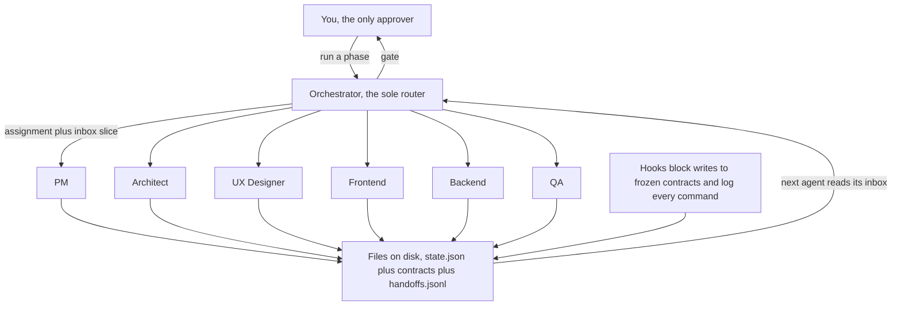

<div align="center">


# OMA — One Man Army

**A full SDLC team of AI agents inside [Claude Code](https://claude.com/claude-code).**
Give it a project idea; it runs Discovery → Architecture → Design → Build → QA →
DevOps → Growth → Ship with role-specialized agents — Project Manager,
Architect, UX Designer, Frontend, Backend, QA, Security, DevOps, SEO, Marketer,
Social — and stops at a gate after every phase for your approval.

[](LICENSE)
[](.claude-plugin/plugin.json)
[](https://code.claude.com/docs/en/plugins)
[](#-installation)
[](#-the-team)
[](#-what-its-been-proven-on)
[](#-contributing)

*You are the one-person company. OMA is your team.*

<br>

### [📖 Never built software before? Start here →](GETTING-STARTED.md)

**[⚡ Install](#-installation)** · **[📂 See a real run](#-see-a-real-run)** ·
**[🚦 How it works](#-how-it-works)** · **[❓ FAQ](#-faq)**

</div>

---

<div align="center">

### One sentence in. A tested application out.

</div>

<table>
<tr>
<td width="33%" valign="top">

**1 · You describe it**

```
/oma:init "Invoicing app
for freelancers"
```

Answer 5–8 questions. That's the whole input.

</td>
<td width="33%" valign="top">

**2 · The team works**

```
/oma:run
```

Twelve specialists, eight phases, in order — each stopping at a gate for you.

</td>
<td width="33%" valign="top">

**3 · You approve, or don't**

```
/oma:gate approve
```

Reject with a reason and the phase redoes itself. Repeat eight times.

</td>
</tr>
</table>

**What you end up holding:** a working repository, 190+ passing tests, clickable
mockups, a PRD, an API contract, a security review with real probes, CI, a
deploy runbook, landing copy and 30 days of drafted posts — plus a written
record of every decision and every failure along the way.

---

## 🎯 What is OMA?

OMA is an open-source **Claude Code plugin** that turns a one-line project idea
into a working, tested repository — the way a real software team would build it,
not the way a single chat session flails at it.

It is a **multi-agent SDLC pipeline**: twelve role-specialized AI agents —
project manager, software architect, UI/UX designer, frontend developer,
backend developer, QA engineer, security engineer, DevOps engineer, SEO
specialist, marketer, social media manager and a codebase archaeologist for
existing projects — that coordinate through
**durable on-disk state** instead of conversation. Sessions are disposable.
The project isn't.

Three things make it different from "ask an AI to build my app":

1. **Phase gates.** Nothing advances until *you* approve. The expensive failure
   mode in AI-built software isn't bad code — it's confident, complete-looking
   output built on a misread requirement. Gates catch that while it's cheap.
2. **Frozen contracts.** The API contract, data model, design tokens and motion
   spec freeze at the gate that authored them, and a plugin hook **physically
   blocks** edits afterward. This is what lets Frontend and Backend build in
   parallel without drifting apart.
3. **Evidence over claims.** A hook logs every shell command and exit code, so
   "the tests pass" is checkable against reality — and in validation, that's
   exactly what caught nine tasks marked done against tests that never existed.

> **Status: complete through M6.** All eight phases are implemented and proven
> end-to-end on a real project — one idea taken from a blank directory to a
> tagged `oma/ship` with a tested application, a security review, CI, a deploy
> runbook and launch material. Brownfield mode reads an existing repository
> first, and is validated against ground truth. You can
> [read a real run](#-see-a-real-run) before installing anything.
>
> ⚠️ **Validated on Next.js only.** Every validation run to date has been a
> Next.js + TypeScript + Prisma application. Other stacks are supported by
> design and have never been tested — see
> [what it's been proven on](#-what-its-been-proven-on) before committing a
> project to this.

## 📑 Table of contents

**New to this?** The [step-by-step guide](GETTING-STARTED.md) walks the whole
path — installing, describing your idea, what to review at each of the eight
stops, and running the finished app. It assumes no coding ability. Everything
below is the reference version.

- 🚀 [Quick start](#-quick-start)
- 💾 [Installation](#-installation)
- 🚦 [The pipeline](#-the-pipeline)
- 📦 [What you actually get](#-what-you-actually-get)
- 👥 [The team](#-the-team)
- ⚡ [Commands](#-commands)
- 🔧 [How it works](#-how-it-works)
- 🗿 [Existing codebases](#-existing-codebases)
- 📂 [See a real run](#-see-a-real-run)
- 🧪 [Proven on a real project](#-proven-on-a-real-project)
- 🎯 [What it's been proven on](#-what-its-been-proven-on)
- 🧱 [The default stack](#-the-default-stack)
- 📋 [Requirements](#-requirements)
- ❓ [FAQ](#-faq)
- 🧭 [Roadmap](#-roadmap)
- 🚧 [Honest limits](#-honest-limits)
- 🤝 [Contributing](#-contributing)
- 📜 [License](#-license)

## 🚀 Quick start

**Install** — from a terminal. It comes straight from this repo, not from
Anthropic's marketplace ([why that works](#-installation)):

```bash
claude plugin marketplace add webmehedi/oma
claude plugin install oma@oma
```

**Start a project** — in a new, empty folder:

```bash
mkdir my-new-project && cd my-new-project && claude
```

```
/oma:init "Invoicing app for freelancers who hate invoicing"
```

Answer 5–8 intake questions. Then the loop — run a phase, review, approve:

```
/oma:run            # runs the next phase, stops at the gate
                    # …review what the agents produced…
/oma:gate approve   # or: /oma:gate reject "the scope is too big"
/clear              # optional but recommended — all state lives on disk
/oma:run            # next phase
```

At the Design gate you get real, clickable mockups — not screenshots, not
"here's a wireframe description":

```bash
python3 -m http.server 4173 -d .oma/03-design/mockups
```

Lost the thread? `/oma:status` tells you where the project stands and the exact
next action. Close your laptop mid-project, come back next week, continue.

> 📖 **Want this explained properly, with nothing assumed?**
> **[The step-by-step guide](GETTING-STARTED.md)** walks the whole path — opening
> a terminal, installing, writing a good one-line idea, what to look at during
> each of the eight reviews, running your finished app, and putting it online.

## 💾 Installation

**OMA installs straight from this repository.** It is not in Anthropic's plugin
marketplace and doesn't need to be — in Claude Code, a "marketplace" is just a
git repo containing a
[`.claude-plugin/marketplace.json`](.claude-plugin/marketplace.json), and this
repo has one. No submission, no review queue, no central registry in the path.

> 📖 **First time doing any of this?** The
> [step-by-step guide](GETTING-STARTED.md#part-1--install-claude-code) covers the
> same ground assuming no prior experience — including opening a terminal and
> installing Node.

### The two-minute version

**1 — check Claude Code is installed:**

```bash
claude --version
```

Prints a version like `2.1.220 (Claude Code)`? Good. `command not found` means
you need it first:

```bash
curl -fsSL https://claude.ai/install.sh | bash
```

**2 — install OMA:**

```bash
claude plugin marketplace add webmehedi/oma
claude plugin install oma@oma
```

**3 — verify, then start a session:**

```bash
claude plugin list
```

`oma@oma` should be listed and enabled.

> ⚠️ **Start a fresh session before running a phase.** OMA's hooks — the ones
> that freeze contracts, log every command and block accidental deploys — load at
> session start. A mid-session install can leave them inert, and that failure is
> *silent*, because
> [every hook fails open by design](TROUBLESHOOTING.md#hooks-dont-seem-to-be-doing-anything).

<details>
<summary><b>Installing from inside a session instead</b></summary>

Identical result, interactive:

```
/plugin marketplace add webmehedi/oma
/plugin install oma@oma
```

`/plugin install` asks for a scope — pick **user** to have OMA in every project.
If the install summary says `Run /reload-plugins to activate.`, run that. Restart
regardless, per the note above.

</details>

<details>
<summary><b>Other install methods for Claude Code itself</b></summary>

| Platform | Command |
|---|---|
| macOS / Linux / WSL | `curl -fsSL https://claude.ai/install.sh \| bash` |
| macOS — Homebrew | `brew install --cask claude-code` |
| Windows — PowerShell | `irm https://claude.ai/install.ps1 \| iex` |
| Windows — WinGet | `winget install Anthropic.ClaudeCode` |
| Any — npm (Node 22+) | `npm install -g @anthropic-ai/claude-code` |

`claude doctor` prints installation and settings diagnostics without starting a
session. Claude Code requires a Pro, Max, Team, Enterprise or Console account;
the free Claude.ai plan doesn't include it. Full matrix:
[Claude Code setup](https://code.claude.com/docs/en/setup).

</details>

<details>
<summary><b>Desktop app</b></summary>

The desktop app's plugin browser (**+** beside the prompt box → **Plugins** →
**Add plugin**) only lists marketplaces you have *already configured*, and
`/plugin` opens a terminal-only panel. So run the two shell commands above once —
the app's own integrated terminal counts — then **restart the app**. OMA appears
under **+ → Plugins**, and its commands work in any Code-tab session.

Plugins aren't available in the desktop app's cloud or WSL sessions. For cloud
sessions, use the settings-file method below.

</details>

<details>
<summary><b>For a whole team, or where no terminal is available</b></summary>

Declare the marketplace and the plugin in `.claude/settings.json`; Claude Code
installs it at session start. This is how you pin OMA for everyone working on a
repository, and the only route into cloud sessions:

```json
{
  "extraKnownMarketplaces": {
    "oma": {
      "source": {
        "source": "github",
        "repo": "webmehedi/oma"
      }
    }
  },
  "enabledPlugins": {
    "oma@oma": true
  }
}
```

Project `.claude/settings.json` shares it with collaborators; `~/.claude/settings.json`
applies it to everything you do. To pin a release rather than track `main`, add
`"ref": "v0.6.3"` alongside `"repo"`.

</details>

<details>
<summary><b>Verifying in depth, updating, uninstalling</b></summary>

**What got installed, and what it costs per turn:**

```bash
claude plugin details oma
```

A complete install reports **8 skills, 12 agents and 4 hooks** (`SessionStart`,
`PreToolUse`, `PostToolUse`, `SubagentStop`) and about **1.7k always-on tokens** —
the skills and agents themselves are only paid for when they fire.

**Updating** — third-party marketplaces don't auto-update by default, so pull
both, then restart:

```bash
claude plugin marketplace update oma
claude plugin update oma
```

Updating never touches your projects: everything OMA knows about a project lives
in that project's `.oma/` directory. [CHANGELOG.md](CHANGELOG.md) has what changed.

**Uninstalling:**

```bash
claude plugin uninstall oma@oma
claude plugin marketplace remove oma
```

Your projects are unaffected — `.oma/` is plain Markdown and JSON committed in
your repo, and stays readable with the plugin gone.

</details>

<details>
<summary><b>Working on OMA itself</b></summary>

Skip installation entirely:

```bash
git clone https://github.com/webmehedi/oma
claude --plugin-dir ./oma
```

A `--plugin-dir` copy takes precedence over an installed one for that session, so
you can test changes without uninstalling first. `bash scripts/selftest.sh` runs
the 41-case hook suite.

</details>

Hit an error? [TROUBLESHOOTING.md](TROUBLESHOOTING.md#installation) covers each
install failure by its exact message.

## 🚦 The pipeline


| # | Phase | Agent(s) | Produces | Freezes |
|---|---|---|---|---|
| 00 | **Archaeology** *(brownfield only)* | Archaeologist | Baseline (green/red, recorded before anything changes), codebase map, and inferred stack, data model, API contract and conventions | — |
| 01 | **Discovery** | Project Manager | PRD with stable `REQ-###` ids, scope boundary, personas, success metrics | — |
| 02 | **Architecture** | Architect | `stack.md` with proven version pins, data model, API contract, ADRs | stack, data model |
| 03 | **Design** | UX Designer | Design system, `tokens.json`, motion spec, **runnable HTML/CSS mockups** | api, tokens, motion |
| 04 | **Build** | Frontend ∥ Backend | Working application code, in parallel, against frozen contracts | — |
| 05 | **QA** | QA Engineer | Test plan, real command runs, failures filed back as tasks | — |
| 06 | **DevOps** | Security, then DevOps | Security review with real probes, CI, Dockerfile, `env.template`, deploy runbook | — |
| 07 | **Growth** | SEO ∥ Marketer ∥ Social | Metadata/sitemap/JSON-LD **in the code**, positioning, landing copy, launch plan, 30-day calendar | — |
| 08 | **Ship** | *(no agents)* | Ship-time verification run, the project's README, the ship report | — |

Each phase ends at a gate, commits its work, and tags it (`oma/gate-03-design`),
so every phase of your project's history is a checkpoint you can diff or roll back to.

## 📦 What you actually get

Not a chat log. A repository, plus the paper trail a real team would have left:

```
your-project/
├── src/  app/  tests/          # the actual working application
├── CLAUDE.md                   # rewritten at every gate — context for any future session
└── .oma/
    ├── state.json              # source of truth: phases, gates, frozen contracts, open questions
    ├── brief.md                # your idea, normalized
    ├── 01-discovery/           # PRD (REQ-### ids), scope, personas, metrics
    ├── 02-architecture/        # stack.md, data-model.md, api-contract.yaml, adr/
    ├── 03-design/              # design system, tokens.json, motion-spec.md
    │   └── mockups/            #   runnable HTML — open it in a browser
    ├── 04-build/tasks.json     # the backlog — every task cites a REQ
    ├── 05-qa/                  # test plan + evidence-based run reports
    ├── 06-devops/              # security-review.md, deploy-runbook.md, env.template
    ├── 07-growth/              # seo-brief, positioning, landing-copy, launch-plan
    │   └── posts/              #   drafted social posts, one file each
    ├── 08-ship/ship-report.md  # what shipped, what didn't, what's known-broken
    └── log/
        ├── handoffs.jsonl      # the message bus — how agents talk
        └── commands.jsonl      # every command + exit code — the anti-fabrication trail
```

Plus, in the repository proper: `Dockerfile`, `.github/workflows/ci.yml`, the
SEO metadata in your routes, and a `README.md` written at ship time.

**The mockups are the headline.** Before a single line of application code
exists, you get real HTML/CSS you can click through — with production-grade
motion built on [Motion](https://motion.dev) and [Lenis](https://lenis.darkroom.engineering),
five states per screen (empty, loading, populated, error, edge), and real
content instead of lorem ipsum. Approve the interface *before* it's expensive
to change. The Frontend agent then treats mockup fidelity as its definition of done.

## 👥 The team

| Agent | Role | Ships in |
|---|---|---|
| `oma-project-manager` | Requirements, scope discipline, `REQ-###` traceability, backlog | ✅ v0.3 |
| `oma-architect` | Stack selection with *proven* version pins, data model, API contract, ADRs | ✅ v0.3 |
| `oma-ux-designer` | Design system, tokens, motion spec, runnable HTML mockups | ✅ v0.3 |
| `oma-frontend` | UI implementation at mockup fidelity, against the frozen API contract | ✅ v0.3 |
| `oma-backend` | Schema, migrations, endpoints, business logic, tests | ✅ v0.3 |
| `oma-qa` | Runs real commands, judges against acceptance criteria, **files — never fixes** | ✅ v0.3 |
| `oma-security` | Probes the running app for broken authorization, secrets, injection, weak sessions; files findings by severity | ✅ v0.4 |
| `oma-devops` | CI, multi-stage container, env template, deploy runbook — each proven locally before handoff | ✅ v0.4 |
| `oma-seo` | Metadata, canonical URLs, sitemap, robots, JSON-LD **written into the codebase**, plus the keyword brief | ✅ v0.4 |
| `oma-marketer` | Positioning, landing copy, launch plan — every claim traced to a shipped requirement | ✅ v0.4 |
| `oma-social` | 30-day calendar and the actual post drafts, in each platform's real format | ✅ v0.4 |
| `oma-archaeologist` | Reads an existing codebase and reconstructs stack, data model, API contract, conventions and ADRs — every one marked inferred, plus a green/red baseline | ✅ v0.5 |

## ⚡ Commands

| Command | Does |
|---|---|
| `/oma:init "<idea>"` | Intake: brief, clarifying questions, workspace, state |
| `/oma:run` | Advance one phase, stop at the gate |
| `/oma:status` | Where the project stands + the exact next action |
| `/oma:gate approve \| reject "why"` | Your decision on the current phase |
| `/oma:phase <name> "<corrections>"` | Deliberately re-run a phase (e.g. redesign) |
| `/oma:change "<request>"` | Change a frozen contract: impact analysis → your decision → versioned re-freeze → rework tasks |
| `/oma:task list \| add \| close \| reassign` | Manual backlog control |
| `/oma:ship` | Final assembly: ship-time verification run, project README, ship report, deploy checklist |

## 🔧 How it works

**Claude Code subagents cannot talk to each other.** Each runs in an isolated
context and returns one text summary. OMA's entire architecture follows from
taking that constraint seriously instead of pretending otherwise.



- **The filesystem is the message bus.** Agents coordinate the way real teams
  do: through artifacts. Every agent ends by appending a structured handoff
  record to `.oma/log/handoffs.jsonl`; the next agent reads its inbox from there.
- **No agent ever spawns another agent.** The orchestrator routes everything —
  otherwise you get depth limits, lost state, bypassed gates and unbounded cost.
- **`.oma/state.json` is the single source of truth** — phases, gates, frozen
  contract hashes, open questions. The project state never lives in conversation.
- **Every task traces to a requirement.** Work citing no `REQ-###` is scope
  creep, and gets rejected at the gate.
- **Hooks enforce what prompts can't.** A `PreToolUse` hook denies writes to
  frozen contracts (verified by SHA-256); a `PostToolUse` hook logs every shell
  command and its exit code; a `SubagentStop` hook catches agents that finish
  without handing off. Prompts are requests. Hooks are walls.
- **Blocking questions halt the pipeline.** When an agent hits a decision only
  you can make, the system stops and asks rather than building on a guess.

### 📚 The rest of the documentation

| | |
|---|---|
| **[GETTING-STARTED.md](GETTING-STARTED.md)** | The step-by-step path from nothing to a shipped app. Assumes no coding ability. |
| **[DESIGN.md](DESIGN.md)** | Full architecture and the reasoning behind every constraint |
| **[TROUBLESHOOTING.md](TROUBLESHOOTING.md)** | Real failure modes, hit during real runs, and what to do |
| **[CHANGELOG.md](CHANGELOG.md)** | What changed, when, and what it fixed |
| **[examples/ledgerly/](examples/ledgerly)** | A complete real run — 74 files, failures included |

## 🗿 Existing codebases

Run `/oma:init` in a directory that already has code and OMA switches to
**brownfield mode**. Instead of inventing a project, it reads yours.

```
/oma:init "add recurring invoices"     # in your existing repo
```

You pick a scope, and it changes what the whole pipeline is allowed to do:

| Scope | For | OMA will |
|---|---|---|
| `extend` | adding a feature | scope Discovery to the new work; treat the existing contracts as read-only reference; **match your conventions even where it would choose differently** |
| `refactor` | restructuring | freeze behavior — your existing test suite becomes the contract, and a task that needs a test edited to pass stops and asks, because that's a behavior change wearing a refactor's coat |
| `audit` | assessing | change **no source code at all** — a hook denies every write outside `.oma/` — and hand back prioritized findings with evidence, plus a backlog nobody has started |

**A new phase runs first.** `oma-archaeologist` reconstructs the artifacts a
greenfield team would have written — `stack.md` from the lockfile (not the
manifest's ranges), the data model from your schema, an API contract from your
real routes, and `conventions.md` describing how your codebase actually does
error handling, validation and data access. From there, every later phase works
unchanged, because the pipeline never cared whether those artifacts were
authored or inferred.

Three rules make it safe to point at code you care about:

1. **A baseline is recorded before anything else.** install → typecheck → lint →
   build → test, with real exit codes, written down. If your project is already
   red, that's the finding — OMA never quietly repairs pre-existing failures and
   can never be blamed for them later, because the arrival state is on disk.
2. **Everything is marked `inferred: true` and cannot freeze until you confirm
   it.** A wrong reconstructed data model is the most damaging thing that can
   happen here: every phase downstream would build on a false description of
   your own database. So the archaeology gate asks you to check the
   low-confidence inferences specifically.
3. **Conventions are extracted, not imposed.** The default stack profile is
   ignored entirely. Where your codebase contradicts itself, the archaeologist
   documents both patterns and asks you which is canonical rather than picking —
   an agent that rewrites working code in its preferred idiom is worse than
   useless.

## 📂 See a real run

Before you install anything, read the output of a real one:
**[`examples/ledgerly/`](examples/ledgerly)** — the complete `.oma/` workspace
from a full eight-phase run. 74 files, 28 agent dispatches, one sentence in, a
tested application out.

It includes the parts that went wrong: the QA report that caught nine tasks
marked done against tests that never existed, a frozen contract changed properly
through `/oma:change` with the ADR behind it, and a ship report that lists every
known issue and accepted security finding by name.

The mockups in it are runnable:

```bash
python3 -m http.server 4173 -d examples/ledgerly/.oma/03-design/mockups
```

## 🧪 Proven on a real project

OMA was validated end-to-end by building **Ledgerly**, a freelancer invoicing
app, from a single sentence through to a green test suite. Not a demo — a real
run, with real failures. What came out:

| | |
|---|---|
| Tasks completed | **28 / 28**, every one citing a requirement |
| Test suite | **191 unit tests + 11 Playwright e2e**, all passing |
| Pipeline | typecheck **0** · lint **0** · format **0** · build **0** |
| Contract drift after 23 agent dispatches | **zero** — all 4 frozen contracts hash-matched |
| Territory violations during parallel Frontend ∥ Backend | **zero** |

The interesting part is what went *wrong*, because that's what the architecture
exists for:

- **QA caught nine tasks marked `done` against vitest tests that did not
  exist.** The build agents had accepted their own work. Because QA files and
  never repairs, it produced a real 167-test suite instead of quietly writing a
  token one.
- **QA then mutation-tested that suite** with ten deliberate defects the Backend
  agent had never named — all caught, control clean. The verifier verified the
  verifier.
- **`/oma:change` ran for real** when QA found the money columns couldn't hold
  values the API contract accepts: impact analysis → unfreeze → surgical schema
  edit + a new ADR → re-freeze at v1.1 with a new hash → migration implemented.
- **Agents died three times** mid-run (API errors, one stall). Disk state
  survived every time; a scoped re-dispatch finished the gap. This is normal
  operation at this scale, not an anomaly — and it's why state lives on disk.

Four defects found in that run are fixed in v0.3.1, including the one that
matters most: **build slices must be ≤ ~2 tasks**, because a 3-task slice
exhausts an agent's context and kills it.

### Phases 06–08, validated separately

The same project was then taken through DevOps, Growth and Ship:

- **The security agent probes, it doesn't read.** It ran a cross-user
  authorization check — 11 operations as user B against user A's records — and
  got 404 on all 11 with the data byte-identical. It also measured a **timing
  oracle**: sign-in responses fell into non-overlapping bands (3.3–8.9 ms vs
  18.9–20.9 ms) that reveal whether an email is registered.
- **Then it was mutation-tested.** A deliberate IDOR was injected into the data
  layer. The agent found it, located the exact lines, reproduced it, graded it
  `high`, filed it as a `harden` task — and separately noted that the existing
  unit tests passed 14/14 *with the hole open*, because none covered that path.
- **DevOps found the container never booted.** `docker build` exited 0 while the
  first `migrate deploy` died on a pruned package. It fixed the prune and added
  a build-time boot proof so a future regression fails the build instead of the
  user's first deploy.
- **The three growth agents ran concurrently** over disjoint files, all three
  handoffs landing intact in the shared log.
- **The orchestrator's own verification caught a defect the agents missed:**
  Growth introduced a build-time environment variable that phase 06's
  `env.template` — written a phase earlier — knew nothing about. Unfixed, every
  canonical URL and sitemap entry ships pointing at `localhost`. Fixed in v0.4.1
  by re-checking env completeness after Growth.

## 🎯 What it's been proven on

Every validation run — M3, M4 and M5 — used **one application**: a Next.js 16 +
TypeScript + Prisma/SQLite invoicing app. That's the honest boundary of the
evidence, and it's worth knowing before you point this at something.

| | Status |
|---|---|
| **Next.js + TypeScript + Prisma** | ✅ Validated end-to-end, three times, greenfield and brownfield |
| Any other JS/TS framework (SvelteKit, Nuxt, Remix, plain Node) | ⚠️ Supported by design, never run |
| Non-JS stacks (Django, Rails, Go, Laravel, .NET) | ⚠️ Supported by design, never run |
| Mobile / desktop / embedded | ❌ Out of scope — the design assumes a web application |

**What should carry over unchanged**, because it's stack-agnostic by
construction: the phase gates, the frozen-contract mechanism, the handoff bus,
`state.json`, the QA repair loop, the security agent's probing method, and the
brownfield archaeologist's approach.

**What is written around Next.js specifically**, and would need work elsewhere:

- `stacks/web-app-default.md` — the default profile, top to bottom
- The mockup pipeline's translation from vanilla Motion → **Framer Motion**
- `oma-seo`'s metadata idioms — `metadata` exports, `robots.ts`, `sitemap.ts`
- `oma-devops`'s container and CI templates (Node-shaped: `npm ci`, standalone output)
- `oma-backend`'s Prisma assumptions in the data layer

**If you use a different stack**, `/oma:init` accepts it and the Architect will
interview you instead of using the default profile. Expect the spec phases to
work well, and expect rough edges in Design, Build and DevOps. Please
[open an issue](../../issues) with what broke — that's the single most useful
contribution to this project right now.

## 🧱 The default stack

Opinionated, and overridable at intake (`/oma:init` asks) — but this is the
combination the pipeline was built around and the only one it has been proven
on:

**Next.js** (App Router) · **TypeScript** strict · **Prisma** · **Tailwind** ·
**Zod** · **Vitest** · **Playwright** · **Framer Motion** + **Lenis**

The Architect doesn't just pin the latest of each package — it pins **the latest
set that composes**, and proves it in a throwaway install (install → typecheck →
lint → build, all green) *before* the stack freezes. That rule exists because
the naive approach hit two real incompatibilities in validation and cost an hour.

## 📋 Requirements

- **[Claude Code](https://claude.com/claude-code)** with plugin support — check
  with `claude --version`, install per [Installation](#-installation). Needs a
  Pro, Max, Team, Enterprise or Console account; the free plan doesn't include it.
- **`git` and `python3`** — the hooks are bash calling python3. Both ship with
  macOS and every mainstream Linux.
- **`node` + `npm`** — for the default web stack, not for the plugin itself.
- **macOS or Linux**, or Windows through **WSL**. The hook scripts are bash;
  native Windows is untested.

Not sure whether you have these? [Part 0 of the getting-started
guide](GETTING-STARTED.md#part-0--what-you-need-first) checks each one and
installs whatever's missing.

## ❓ FAQ

<details>
<summary><b>Do I need to know how to code?</b></summary>

No — you're never asked to write code, and the
[step-by-step guide](GETTING-STARTED.md) assumes no experience.

What you *do* need is honest to say up front: a paid Claude account, a computer
running macOS or Linux (or Windows with WSL), a willingness to type about fifteen
copy-paste commands into a terminal, and — the real one — **a few hours of your
actual attention at the eight gates.** OMA can build the thing; it can't decide
what the thing should be. That judgment is the part only you have, and the gates
are where you supply it.

</details>

<details>
<summary><b>How long does it take from idea to working app?</b></summary>

Roughly a working day of wall-clock in the validation run, spread over as many
sittings as you like. Nothing lives in the conversation, so you can stop
anywhere, close the laptop, and pick up next week with `/oma:status`.

The eight phases are unequal: Discovery and Design want your careful attention,
Build is long and mostly hands-off, and Ship is a verification pass.

</details>

<details>
<summary><b>How is this different from just asking Claude to build my app?</b></summary>

A single session has one context window and no memory of a decision it made two
hours ago. OMA splits the work across specialists, writes every decision to
disk, freezes the interfaces they agree on, and enforces those freezes with
hooks. You also get the artifacts — PRD, ADRs, API contract, design system,
test plan — not just code.
</details>

<details>
<summary><b>Can it work on an existing codebase?</b></summary>

Yes, as of v0.5.0. Run `/oma:init` in a repo that already has code and OMA
enters **brownfield mode**: the archaeologist reads the codebase first,
reconstructs the artifacts a greenfield team would have written, and records a
green/red baseline before anything changes. Pick a scope — `extend`, `refactor`
or `audit`. See [Existing codebases](#-existing-codebases).

The reconstruction is the risk, which is why every inferred artifact is marked
as inferred and none of them can freeze until you have confirmed it matches your
actual system.
</details>

<details>
<summary><b>Will it deploy my app or post to my socials?</b></summary>

No — by design. The DevOps agent writes deploy configs; deploying is your
credentials and your call. The marketing and social agents write copy and
content calendars to disk; they never publish. Agents commit per phase, but
never push.
</details>

<details>
<summary><b>How long does a project take, and what does it cost?</b></summary>

The Ledgerly validation ran roughly a working day of wall-clock across many
sessions and dozens of agent dispatches. This is not a cheap tool — it's a
thorough one. The gates exist partly so you can stop early when a phase reveals
the idea needs rethinking, before you've paid for the build.
</details>

<details>
<summary><b>Can I use a different stack?</b></summary>

Mechanically yes — `/oma:init` asks, you can override anything in
`stacks/web-app-default.md`, and the Architect still has to prove the pins
compose before the stack freezes.

Honestly, though: **no non-Next.js stack has ever been run through this
pipeline.** The parts that are stack-specific — the default profile, the mockup
translation to Framer Motion, the SEO agent's metadata idioms, the DevOps
container and CI templates — are all written around Next.js. The parts that
aren't (gates, contracts, the handoff bus, the QA loop) should carry over
unchanged, but "should" is doing real work in that sentence. If you try Django,
Rails, Go or SvelteKit, please [open an issue](../../issues) with what broke.
</details>

<details>
<summary><b>What if an agent gets something wrong?</b></summary>

Reject the gate with a reason (`/oma:gate reject "the scope is too big"`), and
the phase re-runs with your correction as input. For a targeted redo, use
`/oma:phase 03-design "make the dashboard denser"`. For a frozen contract,
`/oma:change` does impact analysis first, so you see what breaks before deciding.
</details>

<details>
<summary><b>Do I have to babysit it?</b></summary>

At the gates, yes — that's the point, and gates are where your attention is
worth the most. Read the Discovery gate especially carefully; it's the cheapest
place to catch a misunderstanding and the most expensive one to miss.
</details>

## 🧭 Roadmap

| Milestone | Contents | Status |
|---|---|---|
| **M1** | State, handoff bus, hooks, `init` / `status` | ✅ shipped |
| **M2** | Discovery / Architecture / Design phases, gates, contract freeze, mockup pipeline | ✅ shipped |
| **M3** | Build (Frontend ∥ Backend) + QA verification loop + `/oma:change` + `/oma:task` | ✅ shipped · validated end-to-end |
| **M4** | Security, DevOps, SEO, Marketer, Social agents + `/oma:ship` + the deploy guard | ✅ shipped · validated end-to-end² |
| **M5** | Brownfield mode — `extend` / `refactor` / `audit` on existing repos | ✅ shipped · validated³ |
| **M6** | Distribution — worked example in-repo, troubleshooting guide, hook self-test | ✅ shipped |

³ Validated against **ground truth**: the Ledgerly application was stripped of
every artifact OMA wrote — `.oma/`, `CLAUDE.md`, the README, git history, and
every agent attribution left in a comment — and handed to the archaeologist as a
codebase it had never seen. Scored against the originals it could not read:

| | |
|---|---|
| API endpoints | **17/17 found**, 0 invented — verified by calling each one live |
| Data model | **5/5 entities, 24/24 scalar fields**, `BigInt` money columns correctly identified |
| Stack versions | **10/10 correct**, taken from the lockfile |
| Source files modified | **0** |

It also found two things the originals got wrong: a `GET /health` endpoint that
exists in the code but was never added to the frozen API contract, and — the one
that matters — that **a fresh clone of the project does not work**. The generated
database client is gitignored with no `postinstall`, so 91 of 191 tests fail
until `db:generate` is run by hand. The ship report had called the project green,
because it was green in a working directory that already had the generated code.
The audit guard is separately tested at the script level (10 cases).

⁴ All four items are in: this README, the marketplace listing,
[`examples/ledgerly/`](examples/ledgerly) — the complete 74-file `.oma/` from a
real run — and [TROUBLESHOOTING.md](TROUBLESHOOTING.md), built from failures
actually hit during validation rather than imagined ones.

² Phases 06–08 were run end-to-end on the same real project as M3, taking it
from a green build to a tagged `oma/ship`. The security agent ran real
cross-user authorization probes (11 operations); the three growth agents ran
concurrently over disjoint files with no lost handoffs; the ship report
assembled from state with no invented numbers. Two defects found in that run
are fixed in v0.4.1. The security review was then **mutation-tested**: a
deliberate IDOR was injected into the data layer, and the agent located it,
graded it `high`, reproduced it, and filed it as a `harden` task — while also
noting that the existing unit tests passed with the hole open. The deploy guard
is behaviorally tested at the script level (27 cases); it has not been exercised
through an installed plugin session.

## 🚧 Honest limits

- OMA writes deploy configs but **never deploys**. Marketing and social agents
  write copy but **never post**. Agents commit per phase but **never push**.
  As of v0.4.0 this is enforced by a hook, not just asked for: inside an OMA
  project, deploy and publish commands (`vercel deploy`, `docker push`,
  `npm publish`, `terraform apply`, …) are denied outright, and `git push` asks
  first. If you want to deploy, the runbook has the exact command — run it in
  your own terminal.
- **Next.js is the only stack this has ever been validated on.** See
  [what it's been proven on](#-what-its-been-proven-on). Everything else is
  supported by design and untested in practice.
- Agent deaths mid-dispatch are routine at this scale. Recovery is built in
  (work survives on disk, gaps get re-dispatched), but you will see them.
- This is a young project, validated on one application. Expect rough edges,
  and please [file them](../../issues).

## 🤝 Contributing

Issues and pull requests are welcome — especially validation runs on project
types other than a CRUD web app, which is where the sharpest edges hide.

Before opening a PR:

```bash
claude plugin validate .   # manifests
bash scripts/selftest.sh   # all six hooks, 41 behavioral cases
```

The self-test matters more than it looks. Every hook **fails open** — any
internal error exits 0 and allows the action, so a hook bug can never block a
user's work. The cost of that choice is that a broken hook is completely silent.
`selftest.sh` feeds each hook the payload the harness would send and asserts the
decision, so silence gets caught here instead of in someone's project.

Read [DESIGN.md](DESIGN.md) first if you're changing anything about state,
handoffs, or the freeze mechanism — those three carry the invariants everything
else depends on.

## 📜 License

[MIT](LICENSE) © 2026 [Coder71 Limited](https://github.com/webmehedi)

Built and maintained by **S M Mehedi Hasan**, Founder of Coder71 Limited.

---

<div align="center">

### Ready to build something?

**[📖 Start with the step-by-step guide →](GETTING-STARTED.md)**

or, if you've done this before:

```bash
claude plugin marketplace add webmehedi/oma && claude plugin install oma@oma
```

<br>

**Topics:** `claude-code` · `claude-code-plugin` · `ai-agents` · `multi-agent-systems` ·
`sdlc` · `agentic-workflow` · `ai-software-development` · `autonomous-agents` ·
`llm-agents` · `anthropic` · `nextjs` · `typescript` · `developer-tools` ·
`project-management` · `code-generation`

If OMA saved you a sprint, a ⭐ helps other people find it.

</div>
